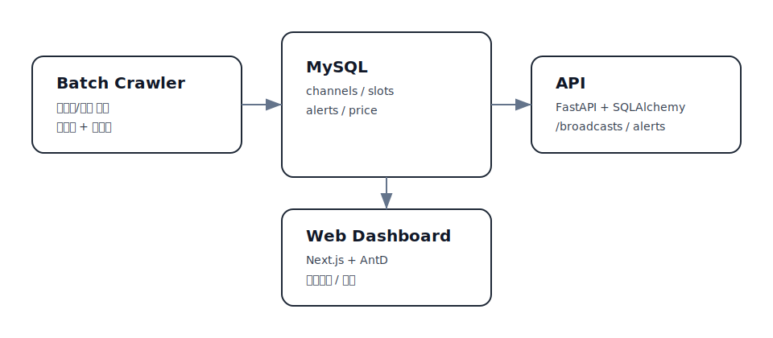
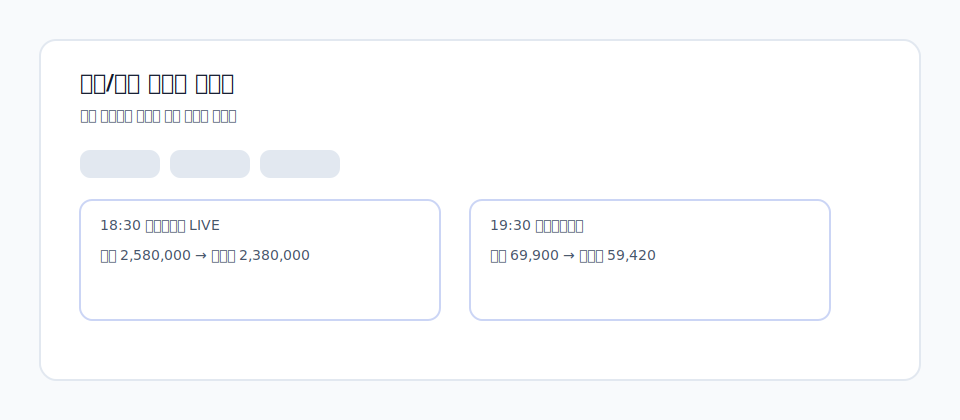

# BroadcastBoard

홈쇼핑 편성표를 자동 수집해 **“지금 방송 중/곧 시작” 정보를 한 화면에 보여주는**
통합 대시보드 프로젝트입니다.  
실제 서비스 운영을 가정해 **배치 수집 → DB 적재 → API → 웹 대시보드 → 알림** 흐름을
처음 보는 사람도 바로 이해할 수 있도록 구성했습니다.

**한 줄 요약:**  
여러 홈쇼핑 채널의 편성표와 가격을 모아, 실시간 타임라인/알림으로 제공하는 MVP.

## 미리보기



## 이 프로젝트가 왜 필요한가
- 홈쇼핑 편성표는 채널마다 흩어져 있어 “지금 뭐가 방송 중인지” 확인이 어렵습니다.
- 가격/쿠폰 정보는 상세페이지에 숨어 있어 비교가 번거롭습니다.
- 이 프로젝트는 **편성표·가격·라이브 링크를 한 번에 모아** 즉시 확인할 수 있게 합니다.

## 누가 쓰면 좋은가
- 홈쇼핑 상품을 자주 비교하는 사용자
- 편성표 기반 알림/모니터링 시스템을 구축하려는 팀
- 홈쇼핑/라이브커머스 데이터를 수집해 분석하려는 개발자

## 핵심 기능
- 편성표 배치 수집 → MySQL 적재
- FastAPI로 편성표/채널/알림 CRUD
- Next.js 대시보드에서 타임라인/알림 관리
- Slack 웹훅 알림 발송(최소 구현)

## 아키텍처 개요
- `apps/batch`: 크롤링 배치 (Fetcher → Parser → Normalizer → Upsert → Logging)
- `apps/api`: FastAPI + SQLAlchemy API 서버
- `apps/web`: Next.js(React) 대시보드
- `scripts`: 로컬 DB 세팅/실행 문서

## 데이터 흐름
1. 배치가 편성표 페이지를 크롤링
2. 파서가 슬롯 리스트로 변환
3. 정규화/해시 생성 → 중복 방지 업서트
4. API가 MySQL에서 슬롯/알림/채널 조회
5. 웹 대시보드가 API 호출로 화면 표시
6. 배치가 알림 규칙과 편성표를 매칭해 Slack 발송

## 시간대 정책
- DB에는 UTC로 저장합니다.
- API 응답은 ISO8601 UTC입니다.
- 프론트에서 KST로 변환해 표시하는 것을 기본 가정으로 합니다.

## 실행 환경 요약
- Python 3.12+ (배치/백엔드 모두 권장)
- MySQL 8.x
- Node.js 18+ (Next.js)

## 로컬 실행 (빠른 시작)
1. DB 세팅: `scripts/setup_local_mysql.md`
2. API 마이그레이션: `apps/api` → `alembic upgrade head`
3. 배치 수집: `apps/batch` → `python -m batch.main fetch_schedule`
4. API 실행: `apps/api` → `uvicorn app.main:app --reload --port 8000`
5. 웹 실행: `apps/web` → `npm install && npm run dev`

## 단일 명령으로 재시작
- 마이그레이션 + API/웹 재시작을 한 번에 실행합니다.
```
bash scripts/dev_refresh.sh
```

## 실제 사용 URL
- 웹 대시보드: `http://localhost:3000` (또는 개발 환경에서 `http://localhost:3001`)
- API 헬스체크: `http://localhost:8000/api/v1/health`
- 편성표 예시: `http://localhost:8000/api/v1/broadcasts?date=YYYY-MM-DD`
  - `date`는 KST(한국 시간) 기준 날짜로 해석합니다.

## 배치 크롤링 소스
- 기본 URL: `https://mobile.gmarket.co.kr/HomeShopping/BroadcastSchedule`
- 변경 위치: `apps/batch/.env`의 `SCHEDULE_SOURCE_URL`
- 채널 목록(`companyId`)을 자동 추출해 **채널별 편성표를 모두 수집**합니다.

## 채널 라이브 링크 정책
- 기본 LIVE 링크는 G마켓 `BroadcastLayer`를 사용합니다.
- 네트워크 오류가 발생하는 채널은 공식 TV 편성표 URL로 오버라이드합니다.
  - 예: `skstoa` → `https://www.skstoa.com/tv_schedule`
- 변경 위치: `apps/batch/pipelines/schedule_pipeline.py`의 `CHANNEL_LIVE_URL_OVERRIDE`

## 라이브 스트림 자동 수집 (Playwright)
- 라이브 스트림 URL을 자동 수집해 `channels.channel_stream_url`에 저장합니다.
- 기본 소스: `https://m.livehs.co.kr/schedule`
- 변경 위치: `apps/batch/.env`의 `LIVE_STREAM_SCHEDULE_URL`

실행:
```
cd /Users/yerimlee/BroadcastBoard/apps/batch
python -m batch.main sync_live_streams
```

주의:
- 최초 1회 `playwright install` 필요
- 수집 결과는 `apps/batch/reports/live_streams_report.json`에 저장됩니다.

## CORS 설정
- API는 `CORS_ORIGINS` 환경변수로 허용 오리진을 제어합니다.
- 예시: `["http://localhost:3000","http://localhost:3001"]`
- 변경 위치: `apps/api/.env`

## API 쿼리 파라미터
- `/api/v1/broadcasts`
  - `date=YYYY-MM-DD` (KST 기준 날짜)
  - `channelCode=...`
  - `keyword=...`
  - `category=식품,의류` (콤마 구분 다중 선택)
  - `status=SCHEDULED|LIVE|ENDED`

## 알림(슬랙)
- 알림 규칙은 API로 생성/수정합니다.
- Slack webhook URL은 `alerts.destination_value`에 저장됩니다.
- 배치 알림 실행: `apps/batch` → `python -m batch.main send_alerts`

## 알림(이메일)
- 알림 규칙 생성 시 `destination_type=EMAIL`, `destination_value=수신 이메일`로 설정합니다.
- SMTP 설정은 `apps/batch/.env`에서 관리합니다.
- Gmail을 쓰는 경우 앱 비밀번호가 필요합니다.
- 배치 알림 실행: `apps/batch` → `python -m batch.main send_alerts`

## 알림 값 암복호화 (권장)
- `alerts.destination_value`는 DB에 **암호화된 값**으로 저장됩니다.
- API/배치는 실행 시 복호화하여 사용합니다.
- 암호화 키는 `ENCRYPTION_KEY` 환경변수로 관리합니다.

키 생성 예시:
```
python - <<'PY'
import base64, os
print(base64.urlsafe_b64encode(os.urandom(32)).decode())
PY
```

## 메뉴 구성 (웹)
- `/` : 오늘/내일 편성표 타임라인
  - 카드 우측 상단의 링크 아이콘을 클릭하면 상품 페이지가 새 탭으로 열립니다.
  - LIVE 상태일 때는 LIVE 뱃지가 링크로 동작하며, 채널 라이브 페이지가 새 탭으로 열립니다.
- `/alerts` : 알림 규칙 관리
- `/trends` : 시간대별 방송 트렌드

## 카테고리(룰 기반)
- 편성표의 `raw_title`을 기준으로 간단한 키워드 룰로 카테고리를 자동 분류합니다.
- 지원 카테고리: 식품, 의류, 리빙, 가전, 뷰티, 건강, 패션잡화, 기타
- 필터 사용: 홈 화면의 카테고리 선택 박스

## 가격/할인 정보
- `sale_price`, `original_price`, `discount_rate` 필드를 제공합니다.
- 방송 편성표에 정가가 없으면 상품 상세 페이지를 추가로 조회해 정가를 보강합니다.
- 관련 설정: `PRODUCT_PRICE_FETCH_ENABLED`, `PRODUCT_PRICE_FETCH_MAX` (apps/batch/.env)
- 봇 차단으로 HTML 가격이 안 잡히면 Playwright 렌더링으로 재시도합니다.
  - `PRODUCT_PRICE_FETCH_BROWSER_FALLBACK`, `PRODUCT_PRICE_FETCH_BROWSER_MAX`

## 라이브 링크 연동
- LIVE 뱃지를 클릭하면 채널 라이브 페이지(`channel_live_url`)로 바로 이동합니다.
- 라이브 링크는 배치에서 자동 세팅되며, 필요 시 DB에서 수정 가능합니다.

## 라이브 스트림 데이터 구조
- 채널 테이블에 `channel_live_url`(페이지 링크), `channel_stream_url`(HLS) 컬럼이 있습니다.
- `channel_stream_url`은 현재 UI에서 직접 재생하지 않지만, 자동 수집 리포트로 활용합니다.

## 문제 해결 (자주 겪는 이슈)
1. CORS 오류
   - 프론트가 `localhost:3001`에서 뜨면 API에 `CORS_ORIGINS` 추가 필요
2. `Access denied for user 'nkshop_user'`
   - MySQL 계정/비밀번호 재확인 후 `apps/api/.env`와 `apps/batch/.env` 수정
3. 배치가 404
   - `SCHEDULE_SOURCE_URL`이 예시 URL로 남아 있는지 확인
4. `pyenv`가 다른 버전을 잡음
   - `PYENV_VERSION` 환경변수 해제 또는 `.python-version` 확인
5. Alembic 마이그레이션이 중복/누락될 때
   - `alembic current`로 버전 확인
   - 컬럼 중복 에러 발생 시 `alembic stamp head`로 동기화

## 배치 스케줄링 (cron)
현재 배치는 수동 실행이 기본이며, 아래처럼 cron으로 자동화할 수 있습니다.

1. 파이썬 경로 확인 (3.12.7 예시)
```
/Users/yerimlee/.pyenv/versions/3.12.7/bin/python
```

2. 크론 등록
```
crontab -e
```

3. 예시 스케줄 (매일 09:00 KST에 편성표 수집)
```
0 9 * * * cd /Users/yerimlee/BroadcastBoard/apps/batch && /Users/yerimlee/.pyenv/versions/3.12.7/bin/python -m batch.main fetch_schedule >> /Users/yerimlee/BroadcastBoard/apps/batch/cron.log 2>&1
```

4. 크론 확인
```
crontab -l
```

주의:
- cron은 환경변수를 로드하지 않으므로, 필요한 경우 `apps/batch/.env`가 반드시 존재해야 합니다.
- 로그는 `apps/batch/cron.log`에 누적됩니다.

## 폴더 설명
- `apps/api/app`: FastAPI 본체 (routes → services → repositories → models)
- `apps/api/alembic`: 마이그레이션 관리
- `apps/batch`: 배치 파이프라인
- `apps/web`: Next.js UI
- `scripts`: 로컬 실행 문서

## 보안
- `.env` 파일은 커밋하지 않습니다.
- 제공된 `.env.example` 파일을 복사해 사용하세요.
